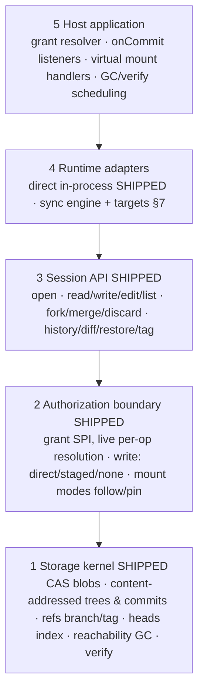

# tuddofs — Architecture & Roadmap Spec

**Date:** 2026-08-11
**Status:** Kernel and session layers SHIPPED (unit + real-Postgres integration tests). This document specifies the remaining roadmap: sync engine and large-blob streaming.
**Positioning:** A product of its own — the `tuddofs` npm package. Any application that supplies a Postgres pool, actor identity, and a grant resolver is a consumer.

**How to read this document if you are implementing:**

- §4–§6 and §9 describe the **shipped** system. Their invariants remain normative, but the pin is now the code: `src/migration.ts` (frozen-schema check), `fixtures/golden-hashes.json` (hash preimages), and the integration suites. If this document and the shipped behavior disagree, the code + tests win and this document has a bug — fix the document.
- §7 (sync engine) and §8 (large blobs) are **NORMATIVE for unbuilt work** — the algorithms, tables, and invariants are the answer; do not improvise alternatives.
- §13 tells you how to work. When this document is ambiguous, STOP and ask; do not fill gaps with guesses.

---

## 1. What this is

A **multi-tenant, permission-confined, branchable filesystem for AI agents.** Postgres + object storage. Embeddable TypeScript library.

One sentence: _git's object model with your application's permissions, built for agents that run anywhere._

The moat: competitors treat files as agent scratch. Here files are **governed user data** — scoped to whatever mounts the host defines, access-controlled by the host app's live permission logic, with agent changes flowing through branches and honest merges.

## 2. Requirements

| #   | Requirement                                                                                                            | Status                                                   |
| --- | ---------------------------------------------------------------------------------------------------------------------- | -------------------------------------------------------- |
| R1  | Concurrent agents on the same user's data — isolated, merge with honest conflicts                                      | shipped                                                  |
| R2  | One FS contract for both runtimes: in-process agent AND sandboxed/remote agent                                         | session API shipped; remote half is the sync engine (§7) |
| R3  | Real files inside a workspace so shell tools (bash, grep, any binary) work natively                                    | sync engine (§7)                                         |
| R4  | Durable per operation; workspace death loses at most the exec in flight                                                | sync engine (§7)                                         |
| R5  | Multi-source mounts in one agent view; mount vocabulary is the host's                                                  | shipped                                                  |
| R6  | Agent confined to the executing user's grants, resolved live, on every operation                                       | shipped                                                  |
| R7  | Versioned + attributed (user, agent, run) + restorable — structurally                                                  | shipped                                                  |
| R8  | Small working sets (dozens of files); correctness over throughput                                                      | design stance, unchanged                                 |
| R9  | Standalone npm package, zero hard runtime deps; pool/storage/logger/grants injected                                    | shipped                                                  |
| R10 | Coexists with host product surfaces via events (`onCommit`) and virtual mounts — the package never knows its listeners | shipped                                                  |
| R11 | Large binaries/media streamed via presigned object-storage I/O, never through server memory                            | §8                                                       |

## 3. Architecture — five layers



Load-bearing rule for every layer: **agent tools never talk to the kernel — they talk to a session (tool-level) or a materialized mirror (disk-level); the sync engine is the only bridge.**

---

## 4. Layer 1 — storage kernel (SHIPPED; invariants normative)

### 4.1 Schema

Tables (all `tuddo_*`, package-owned, created by exported `migrate()`; frozen-schema drift check on every boot): `tuddo_blobs`, `tuddo_trees`, `tuddo_tree_entries`, `tuddo_commits`, `tuddo_refs`, `tuddo_heads`, `tuddo_migrations`. Exact DDL: `tuddoFsDdl` in `src/migration.ts`. Migrations are numbered and immutable once merged.

Structural invariants (each enforced in DDL or code, each has a test):

- `tuddo_blobs`: exactly one of `inline` / `object_key` is non-null (`CHECK`); `UNIQUE (tenant, sha256)`.
- `tuddo_tree_entries.blob_id` → `ON DELETE RESTRICT` — the hard GC floor.
- `tuddo_commits.parents` is ordered; `parents[1]` = "ours" from the ref's own lineage.
- `tuddo_refs` PK `(tenant, name)`; branch states `open|merged|conflicted|unauthorized|abandoned`; tags use state `'tag'` and are immutable.
- `tuddo_heads` is a DERIVED tip index — rebuildable from ref→commit→tree; `verify()` audits it.

### 4.2 Canonical hashing (pinned FOREVER by golden fixtures)

- `tree_sha` = sha256 over entries **sorted by `path` as UTF-8 bytes ascending** (`Buffer.compare`, never JS string sort), each serialized `path` + `\0` + `mode(decimal)` + `\0` + `blob_sha256_hex` + `\n`. Empty tree = sha256 of empty string.
- `commit_sha` = sha256 over `tree\0<tree_sha>\n` + one `parent\0<sha>\n` per parent in stored order + `author\0<author_user>\0<agent_kind ?? ''>\0<thread_id ?? ''>\0<run_id ?? ''>\n` + `ts\0<ISO-8601 UTC, ms precision>\n` + `op\0<op>\n`.
- `created_at` in the preimage is application-generated and passed explicitly — never the column default.
- NULL and `''` hash identically by design; storage canonicalizes to NULL so verify() recomputation is deterministic.
- `fixtures/golden-hashes.json` pins exact digests including the astral-plane path, the `/a.md` + `/a/x.md` pair (0x2E vs 0x2F), and a case pair. These tests are append-only: if one fails after a change, the change is wrong.

### 4.3 Path rules & tree coherence (validated at every entry point; reject, never "fix")

NFC-normalize, then: `^/[^\0]*$`, no `//`, no trailing `/`, no `.`/`..` segments, max 1024 bytes UTF-8, case-sensitive. Symlinks do not exist in the kernel model.

**Directories are implicit.** Trees contain only file entries keyed by full path; folders exist because file paths pass through them. There is no directory object, no `mkdir`, no empty directory (hosts wanting empty-folder UX use a keep-file convention). This is deliberate and permanent: directory entries would extend the §4.2 preimage format (identity corruption for every existing commit), add git's D/F conflict family to the §9 decision table, and complicate the one-exec capture scan — for scaffolding value a keep-file already provides.

**Tree-coherence invariant (NORMATIVE; enforced):** within one tree, no path may be a directory-prefix of another (`/a` file + `/a/x.md` is incoherent). Git's nested trees prevent this structurally; flat trees MUST enforce it explicitly, or `list` silently masks the file behind the synthesized directory and Phase-1 materialize hits an impossible disk state (a real filesystem cannot hold file `a` and directory `a/`). Enforcement is asymmetric by design:

1. **write/edit:** reject with `InvalidPathError` naming the colliding entry — API callers must be explicit (`delete('/a')` first).
2. **capture (§7.3):** disk is the observed truth and cannot collide with itself, but the branch head can disagree mid-run (`rm a && mkdir a && touch a/x.md` — the `rm` normally lands only at reconcile). Capturing a path that implies a directory where the head has a file includes that file's deletion in the same commit.
3. **merge (§4.5):** two individually-coherent trees can merge into an incoherent union (ours adds file `/a`, theirs adds `/a/x.md` — different paths, no per-path conflict). After the per-path pass, validate the merged tree; a collision is returned as a conflict on both paths, never committed.

### 4.4 Ref naming

- Session branch: `agent/<sessionId>/<mountKey>` · mount tip: `mount/<mountKey>` · tag: `tag/<mountKey>/<label>`.
- Re-fork of the same (session, mount) reuses the existing ref — idempotent, never an error.
- Mount keys validated at `open()`: `^[a-z0-9][a-z0-9:._-]{0,63}$`. Keys are embedded in ref names, mirror paths, and exec lines; this charset is what keeps the §7 disk-path → mountKey reverse mapping unambiguous.

### 4.5 Core algorithms (shipped; see file-header comments for the full step lists)

- **Write** (`kernel.ts`): grant → hash → object-store upload BEFORE the tx (idempotent HEAD-first) → single-tx blob/tree/commit insert with CAS ref update (`UPDATE … WHERE commit_id=$expected`, max 3 retries) and heads update **in the same tx** → post-commit `onCommit` via `setImmediate`, failures logged, never fail the write. Same-sha writes are no-ops (no empty commits). `ifSha` mismatch → `PreconditionFailedError`, no retry. §4.3 coherence check against current heads runs inside the tx.
- **Fork**: metadata-only; genesis (empty tree, `op='import'`) created inside the tx on first touch; concurrent geneses race safely via `ON CONFLICT`, loser adopts winner. `base_commit` recorded at fork **is** the merge base — no merge-base graph walk exists or should.
- **Merge**: `pg_advisory_xact_lock(hashtext(tenant || ':mount/' || key))`; grants re-resolved inside the tx (freshness bound 100ms of pool wait); staged writer without approver → `pendingApproval`; approver must resolve `direct` live. Conflicts are computed, returned as data, never stored. Completed-merge re-run produces no commit. §4.3 merged-tree coherence validation — collision ⇒ conflict result.
- **GC**: reachability mark from ALL refs + grace window (default 24h); settled-branch retention 7d; five sweeps ending in orphan-object listing under `tuddo/<tenant>/`; single-flight per tenant via `pg_try_advisory_lock('tuddo:gc:' || tenant)` — a worker that fails to acquire SKIPS, never queues. Batched deletes (500/batch). FK violation mid-sweep = "referenced mid-sweep": drop the batch, continue.
- **verify()**: recompute tree/commit shas, rebuild expected heads per ref, spot-check object storage, audit `parents[]` referential integrity (arrays carry no FK) and orphaned heads. Content-addressing is a set-cardinality commitment only if something recomputes it — hosts MUST schedule verify (§10). §4.3 coherence audit over ref-tip trees (flags any pre-enforcement incoherent tree).

### 4.6 As-built defaults

| Constant                 | Value                                         |
| ------------------------ | --------------------------------------------- |
| `inlineMaxBytes`         | 131 072                                       |
| CAS retries              | 3                                             |
| GC grace                 | 24 h                                          |
| Settled-branch retention | 7 d                                           |
| Maintenance batch size   | 500                                           |
| Grant cache TTL          | 30 s (hard-capped at 30 s — cannot be raised) |
| Grant resolver timeout   | 5 s                                           |
| Merge grant freshness    | 100 ms                                        |
| Object key format        | `tuddo/<tenant>/<sha256>`                     |

## 5. Layer 2 — authorization boundary (SHIPPED; rules normative)

```ts
type WriteMode = 'direct' | 'staged' | 'none'
interface GrantResolver {
  resolve(actor: Actor, mount: { key: string }): Promise<{ read: boolean; write: WriteMode }>
}
```

Rules (each is a test in `grants.test.ts` / `grants.integration.test.ts` / `session-security.integration.test.ts`):

1. **Fail closed.** Resolver throw / timeout / malformed result → deny + `GrantResolverError`. NEVER fail open.
2. **Live per-op resolution.** Cache TTL ≤ 30s + `invalidate(actorId, mountKey?, tenant?)`. Merge and fork ALWAYS bypass the cache.
3. **Permission never travels through time.** Fork checks read at fork time; write checks at write time; merge re-resolves inside the merge tx.
4. **`staged` never escalates.** Merge requires an approver whose live grant is `direct`; approver tenant must match the session tenant.
5. **Pinned mounts are read-only by construction.** Pins and raw commit lookups are lineage-confined — a commit sha outside the addressed mount's lineage is `NotFoundError`, even if it exists in the tenant.
6. Sessions carry the **executing user's** actor; `id: 'system'` is rejected at `open()`. No elevated actor exists in the session path.
7. **Scope identity is server-derived, never model-constructed.** Mount keys, tenant, branch names come from the session the host opened — never from LLM output, tool arguments, or sandbox-reported data.

Multi-worker caveat (host guide, §10): per-process `invalidate()` does not reach other workers; correctness rests on the short TTL plus the unconditional merge/fork bypass. Never lengthen the TTL to "fix" resolver load — the cap is enforced in code.

### 5.1 Identity taxonomy (never collapse these)

| Identity                                        | Where it lives                                                              |
| ----------------------------------------------- | --------------------------------------------------------------------------- |
| Trigger/attribution — the human on whose behalf | `commits.author_user`                                                       |
| Execution — who performs operations             | session `actor` (always the executing user)                                 |
| Agent provenance — which automation             | `commits.agent_kind / thread_id / run_id`                                   |
| Authorization — whose grant permits             | GrantResolver result at op time; merge `approver` may differ under `staged` |
| Tenant — which boundary                         | `tenant` column on every table; refs PK includes tenant                     |

## 6. Layer 3 — session API (SHIPPED)

Surface (authoritative shapes: `dist/index.d.ts`):

```ts
const fs = createTuddoFs({ pool, grants, storage?, logger?, onCommit?, schema?, … })
await fs.migrate()   // via exported migrate(pool, { schema })
const s = await fs.open({ actor, sessionId, mounts: MountSpec[] })
s.read / s.readBytes / s.write(p, bytes, {ifSha?}) / s.edit(p, edits, {ifSha?}) / s.delete
s.list / s.glob / s.stat
s.merge({approver?}) → per-mount 'merged' | {conflicts} | 'unauthorized' | 'pendingApproval'
s.resolveMerge(mountKey, {approver?}) / s.discard()
s.history(p) / s.timeline({run?|agent?|thread?}) / s.diff(a, b)
s.restore(mountKey, at) / s.tag(mountKey, label)   // new commits/refs; history is never rewritten
createDirectAdapter(s)                              // tool-shaped fns for an in-process agent loop
```

The block above is the surface as SHIPPED. §6.2 narrows and amends it at S1 — new code builds against §6.2, not this block.

- Paths are `mountKey:/absolute/path`. Nothing outside the mount table is reachable.
- `edit` = read head → apply structured edits → write with `ifSha` of what was read. Convenience, not a kernel primitive.
- `history`/`timeline`/`diff` are lineage- and grant-confined (see security suite): they never surface commits unreachable from the session's granted mounts.

### 6.1 Virtual mounts (SHIPPED)

Host-managed `list/read/write?` handlers serve live host data through the same file surface. No refs, no commits, no merge/history/restore/tag (those throw, never return silently empty). Authorization is the handler's job, invoked with the executing actor; handlers MUST fail closed. Virtual mounts are tool-level only: the sync engine (§7) MUST skip them at materialize and reject them in mirror-path mapping — a copy of live data is stale by definition, and capture would try to commit it.

### 6.2 Consumer surface — API tiers (NORMATIVE; specced, NOT YET CUT — gates S1)

The required concepts are five and irreducible: pool, grant resolver, actor, mounts, sessionId — a governed FS without them is a KV store. The complexity that IS removable is surface leakage, and it gets cut before new features are built on the wide surface:

1. **Tier 1 — main entry (`tuddofs`), all most hosts ever see:** `createTuddoFs` returning `{ migrate, open, gc, verify, invalidate }` only; `createDirectAdapter`; typed errors (§9); public types. Nothing else.
2. **Tier 2 — `tuddofs/internal` subpath:** kernel ref-level ops (`fork`/`read`/`write`/`delete`/`restore` taking raw tenant+ref), hashing helpers (`sha256`, `treePreimage`, `hashTree`, `commitPreimage`, `hashCommit`), `GrantController`, validation functions. Same code, out of the storefront. Rationale: kernel `write` takes a raw ref — usable only by callers who understand §4.4 naming, and it sidesteps session addressing; two same-named `write`s at different abstraction levels on one object is a foot-gun. No §10 host obligation requires any Tier-2 symbol.
3. **Mount handles for typed host code:** `session.mount(key)` returns the file ops bound to one mount, taking plain `/paths`. Compound `mountKey:/path` addressing remains the adapter/tool contract ONLY — one string per path is a feature at the LLM-tool boundary, noise in host code. One convention per audience.
   - **Engine surface on the mount handle (AMENDED at S1).** `session.mounts()` and `session.mount(key).capture({writes, deletes})` are reachable from the Tier-1 `open()` result and are named here so the tier boundary stays exhaustive. They exist for the sync engine (§7.3 phase 3 step 5) and are NOT tool verbs: `mounts()` is the server-derived mount table the engine reads instead of trusting a host list or the target (§5 rule 7), and `capture()` commits one scan of one mount as a single commit with bytes the caller has already fetched and re-hashed. `createDirectAdapter` does not expose either. The engine itself — `createSyncEngine`, `createLocalDirectoryTarget`, the `SyncTarget` seam, `SyncTargetError` — stays in Tier 2 (`tuddofs/internal`) until §15.4 closes.
4. **Contract fixes riding the same cut:**
   - `edit()` drops offset-based `TextEdit` (`{start, end, text}`, UTF-16 code units — the most error-prone contract an LLM harness can receive) for str-replace: `{oldText, newText, replaceAll?}`; zero or multiple matches without `replaceAll` → `EditMatchError` (§9, added at S1, carries the match count); `ifSha` concurrency unchanged.
   - `resolveMerge` is removed — it is by definition (§4.5) a re-run of `merge`; the surviving method is `merge({mounts?, approver?})`, returning per mount a discriminated `{status: 'merged'|'unauthorized'|'pendingApproval'|'conflicts', conflicts?}` instead of the string-or-object union.
   - `open()` accepts `mounts: ['project:notes']` as shorthand for `[{key: 'project:notes'}]`.

This is a breaking cut taken deliberately now, while adoption is zero and versioning is release-driven; every release that ships the wide surface makes it more expensive.

**Simplifications considered and REFUSED (do not revisit without new evidence):** auto-generated `sessionId` (callers own it — idempotent re-fork and crash-resume depend on it; auto-generation trades one string for silent orphan branches) · auto-migrate on first use (implicit DDL on the request path) · a bundled allow-all dev resolver (would be copy-pasted into production; the resolver IS the security model) · deferring sync Phase 3 (it is the R4 durability mechanism, not a latency feature) · collapsing the §9 error taxonomy (hosts switch on it; each error maps to a distinct recovery).

---

## 7. Layer 4 — sync engine (NORMATIVE, UNBUILT)

Purpose: real files on a disk somewhere (local machine, SSH host, sandbox provider), so any binary works natively, with the kernel remaining the source of truth.

### 7.1 SyncTarget — the universal seam

```ts
interface SyncTarget {
  exec(cmd: string, opts?): Promise<{ exitCode: number; output: string }>
  readFile(path: string): Promise<Buffer>
  writeFile(path: string, bytes: Buffer): Promise<void>
  mkdir(path: string): Promise<void>
}
```

The engine never imports a provider SDK. First-party targets, in build order:

1. **Local directory** (S1) — child-process exec + node:fs. This is a product story in itself (governed workspace for CLI/harness agents on a trusted machine) and makes the whole engine CI-testable with zero infrastructure. Grant confinement protects the FS, NOT the host; sandboxes exist for untrusted code — document this, loudly.
2. **SSH** (S2) — the cheapest honest remote: real network, real quoting hazards, no vendor SDK. Proves seam portability.
3. Provider targets (E2B, Blaxel, …) — doc recipes or separate packages, never in core.

### 7.2 Engine events

There is no host tool loop to piggyback on. The engine exposes callbacks; the embedding app wires them to whatever loop it has:

```ts
interface SyncEngineEvents {
  onCapture(e: { mountKey: string; commitSha: string; paths: readonly string[] }): void
  onCaptureFailed(e: { mountKey?: string; attempt: number; error: Error }): void
  onReadOnlySkipped(e: { mountKey: string; paths: readonly string[] }): void
}
```

A failed scan is an error event, never an empty diff. Silently treating exec failure as "no changes" disables capture exactly where it is needed most.

### 7.3 Four phases (NORMATIVE)

**State:** server-side branch index `Map<mountKey, Map<path, sha256>>` (a CACHE — rebuildable from heads + full scan); stamp file `<root>/.tuddofs-stamp` in the target.

**Phase 1 — materialize (acquire):**

1. Precondition probe: `exec("sha256sum --version && find --version")` — GNU coreutils required (busybox lacks `--zero`). Fail loudly at acquire, not silently at capture.
2. Per mount: write branch-view files under `<root>/<mountKey>/…`; `chmod -R a-w` read-only mounts; verify (spot-check shas); write hydrated marker LAST; seed index; `touch` stamp. **AMENDED at S1:** the acquire stamp uses the same backdated form as step 6 below, which puts it before the files hydration just wrote, so the first incremental scan re-hashes them once and commits nothing. That waste is deliberate. Stamping from the hydration marker's own mtime removes it and breaks capture: `find -newer` is STRICTLY newer, the marker and the agent's first writes land in the same coarse filesystem tick, and those writes then never reach a Phase-3 scan — measured, three kill-matrix cases go silent. Re-hydrating a frozen mount unfreezes it with `chmod -R a-w,u+w`, the exact inverse of the freeze over the mirror's two legal states (no write bit; owner write only).
3. Warm re-acquire: liveness probe + index check only — NEVER a per-file probe.

**Phase 2 — write-through (file tools):** kernel commit first (§4.5) → index update → mirror `writeFile` (async; on failure mark path dirty → re-materialize on next touch). Grant refusal happens before the commit; nothing touches disk.

**Phase 3 — exec capture** (after every shell-capable call; fire-and-forget; ONE in flight per target, extra triggers coalesce to exactly one follow-up; the slot is RELEASED on failure as well as success):

1. `scanStart = now()`. One exec. **AMENDED at S1:** the illustrative pipeline `find … -print0 | xargs -0 -r sha256sum --zero` is REPLACED by `cd <root> && find <mountDirs> -type f -newer .tuddofs-stamp -print0 > .tuddofs/scan && xargs -0 -r sha256sum --zero < .tuddofs/scan`. A pipeline reports `xargs`' exit status, so a failed `find` — a deleted mirror directory, a permission change — would arrive as exit 0 with no records, which is precisely the "empty diff" §7.2 forbids. The scratch list is engine-owned and lives outside every mount mirror.
2. Parse NUL-terminated records. REJECT any path that, after normalization, escapes its mount dir — the target is untrusted input.
3. Diff against index. Same sha → drop.
4. Fetch changed bytes (`readFile`; large blobs: §8.2 presigned path). **Recompute sha server-side on fetched bytes** — never trust the target-reported sha for commit identity.
5. One commit per touched mount (§4.5 batch form, `op='capture'`, run attribution); apply the §4.3 capture rule — a captured path implying a directory over a head file includes that file's deletion in the same commit. Read-only mounts: skip + `onReadOnlySkipped`.
6. `touch -d @<scanStart - 1s> .tuddofs-stamp`. Files written during the scan re-appear next cycle; sha-diff makes re-capture a no-op. **AMENDED at S1:** the stamp trails `scanStart` by a one-second granularity margin. Filesystem mtimes come from a coarse clock (Linux rounds down to the last tick, older filesystems to the last second) while the engine's clock is fine-grained, so a write that happens strictly AFTER an exact stamp can still record an mtime before it and vanish from `find -newer`. §7.4 requires under-capture to be impossible and accepts over-capture as a sha no-op; an exact stamp delivers the opposite.

**Phase 4 — turn-end reconcile (authoritative):** full scan (no `-newer`), capture stragglers, then deletes: path in index, absent on disk → deletion in the commit. Straggler guard: a path whose disk sha ≠ index sha is a capture candidate ONLY if the disk sha also ≠ that path's PREVIOUS head sha; if disk == previous head, the Phase-2 mirror write never landed — re-materialize the path instead of committing, or reconcile reverts the agent's own tool write. Anything the host wants to do per-commit rides `onCommit` — there is no special-cased path handling in the engine.

**AMENDED at S1 — the straggler guard is WINDOWED, and it survives resume.** Two clarifications the implementation forced, both load-bearing:

- The guard covers exactly the window between a Phase-2 commit and the first scan that observes those bytes on disk. That scan RETIRES it. Held open for the session, the guard misreads every later return to the pre-write content — `git checkout`, a formatter, an undo — as a lost mirror write, re-materializes over the agent's file, commits nothing and fires no event: silent, permanent loss, armed for the rest of the session. The same rule applies to the absent-on-disk case: a path is protected from deletion only until a scan has confirmed its mirror write. Consecutive writes before that first confirming scan compare against the last CONFIRMED sha, not the intermediate one the mirror may never have held.
- The guard is process memory, and §7.5 line 1 ("tool write survives instant target kill") has to hold across a restart too. A warm re-acquire (phase 1 step 3) seeds the index from heads, which carry no straggler state, so a crash between commit and mirror write would leave reconcile committing the stale disk bytes back over the durable commit — or deleting a committed file the mirror never received. On a warm-acquired mount, therefore, divergence is checked against DURABLE HISTORY until the first authoritative scan: for each divergent already-committed path, if its newest commit is a Phase-2 `write` and the disk holds that commit's parent sha (or the write created the path and disk holds nothing), the mirror write never landed and the path is re-materialized. A `capture` commit is never a candidate — its bytes were READ off the mirror, so they were on disk by construction. The lookup is per divergent path, once per resume, and never touches the write path. Persisting the index into the target was considered and REFUSED: the target is untrusted input (§13 never-do list), and guard state read back from it would let a target direct the engine to overwrite files.

### 7.4 Gotchas (each has caused real bugs in systems like this; each becomes a test)

- **mtime is a prefilter only**, used inside the target where stat is local. Transfer decisions are ALWAYS sha-vs-index. Never build on provider metadata.
- The `-print0 | xargs -0 | --zero` chain is mandatory — plain `sha256sum` escapes weird names and breaks naive parsers.
- Stamp granularity: 1s-mtime filesystems make over-capture harmless (sha no-op) and under-capture impossible (`touch -d @<scanStart>`).
- Torn files (agent mid-write during scan): partial content commits; next cycle supersedes; history keeps both. Do NOT build a "still being written" heuristic — let idempotency absorb it.
- `find -type f` does not follow symlinks — correct. Never add `-L` (symlink to `/etc/passwd` would exfiltrate host files into a commit).
- Deletes ONLY at reconcile. A rename appears as delete+create — acceptable, documented.
- No inbound sync mid-run, ever. Branch views are immutable; parent changes arrive at merge. "Live refresh" = a new session, not a sync feature.
- Everything interpolated into an exec line or mirror path is hostile until validated: mount keys already satisfy §4.4's charset; single-quote every interpolated value (presigned URLs contain `&`); mirror-dir names encode `:` deterministically (Windows targets); destructive execs (`chmod -R`, cleanup deletes) MUST refuse any path that does not resolve strictly under `<root>`. The root-guard survives whatever quoting bug slips through.

### 7.5 Acceptance (kill matrix)

- Tool write survives instant target kill (commit landed before mirror write).
- Killed exec loses at most itself; reconcile recovers everything on disk.
- Capture failure re-triggers and surfaces via `onCaptureFailed`; N failures never wedge the slot.
- Hostile-input suite: path escapes, quoting collapse, symlink exfiltration attempt, mount-escape in scan output.

## 8. Large blobs (NORMATIVE, UNBUILT)

Two independent halves. The `BlobStore` SPI already declares `presignPut(key, {ttlSeconds, checksumSha256})` / `presignGet(key, {ttlSeconds})` — **declared but exercised nowhere today**, which makes them an untested contract; both halves below put them under test.

### 8.1 Session streaming (independent of the sync engine)

- `readStream(address)` → `Readable` straight from `BlobStore.get` for CAS blobs (inline blobs wrap a buffer); never buffer the whole object.
- `writeStream(address, source)` → hash-on-the-fly (sha256 transform stream) while uploading to a **quarantine key**; on stream end, server-side copy/rename to `tuddo/<tenant>/<sha>` and run the §4.5 tx. Identity always binds to the bytes actually stored.
- `presign(address)` issuance API for hosts that want client-direct I/O: GET presigns for reads; PUT presigns pin `x-amz-checksum-sha256` as a signed header so the store itself rejects non-matching bytes.

### 8.2 Sync-engine capture path (depends on §7)

Large changed files upload direct from the target via `exec(curl …)` against a presigned PUT with the claimed sha pinned as a signed checksum header (S3/MinIO enforce this). On a store without checksum enforcement: upload to a quarantine key, re-hash server-side via GET stream, then server-side copy to the CAS key. Existence+size alone is NOT verification — a lying target could otherwise poison the CAS entry for a sha other branches later dedupe against.

### 8.3 Acceptance

2 GB round-trip against MinIO (testcontainer, `forcePathStyle`), flat server RSS, through both the session streaming API and the sync capture path. Presign SigV4 caveat for the host guide: presigned URLs embed the endpoint host, so target-direct I/O requires the blob endpoint reachable from the target network; a LAN-only MinIO downgrades large-blob capture to the server-relay path.

### 8.4 Reference adapter

Ship `@tuddofs/s3` (or equivalent) as a separate package implementing `BlobStore` against S3/MinIO/R2. Core keeps zero storage SDKs. A standalone product with a never-implemented SPI is a contract nobody has honored — the adapter is what proves it.

## 9. Merge decision table & error taxonomy (SHIPPED; tables normative)

The 14-row (base, theirs, ours) decision table is implemented and unit-tested per row; the classifier is exhaustive — an unmatched combination throws, never defaults silently:

| base   | theirs (mount) | ours (branch) | action            |
| ------ | -------------- | ------------- | ----------------- |
| A      | A              | A             | no-op             |
| A      | A              | B             | take B            |
| A      | B              | A             | keep theirs       |
| A      | B              | B             | no-op (converged) |
| A      | B              | C             | **conflict**      |
| A      | A              | absent        | delete            |
| A      | B              | absent        | **conflict**      |
| A      | absent         | A             | keep their delete |
| A      | absent         | B             | **conflict**      |
| A      | absent         | absent        | no-op             |
| absent | absent         | B             | create B          |
| absent | B              | B             | no-op             |
| absent | B              | C             | **conflict**      |
| absent | B              | absent        | keep theirs       |

Mode-only changes count as content changes (mode is in the tree entry).

Exported errors (hosts and tools switch on these; never swallowed, never wrapped generic): `InvalidPathError`, `InvalidMountKeyError`, `InvalidCommitTimestampError`, `PermissionDeniedError`, `PreconditionFailedError`, `RefConflictError`, `NotFoundError`, `BranchSettledError` (message prescribes recovery: open a new session — never a dead end), `MergePendingApprovalError`, `GrantResolverError` (failed CLOSED), `SchemaDriftError`, `StorageError`, `InvariantError`; at S1, `EditMatchError` (str-replace `edit()` found zero or multiple matches without `replaceAll`; carries the match count — §6.2). Every error carries `{tenant, mount?, path?, ref?}` context. Conflicts are a merge RESULT, not an exception.

**AMENDED at S1 — `SyncTargetError`.** The sync engine adds one typed error to the taxonomy: a `SyncTarget` operation failed — a probe, a scan, a stamp update, a verification read — carrying the exit code and output alongside the usual context. It exists because §7.2 forbids the alternative: a failed scan MUST surface as an error, never as an empty diff, and a generic `Error` gives the host nothing to switch on. It ships from `tuddofs/internal` beside `createSyncEngine`, not from the Tier-1 entry, and moves to Tier 1 with the engine when §15.4 closes.

Decision: there is no merge-policy hook. `onCommit` covers eventing, and merge policy is the host's decision about _when to call_ `merge()` and with which approver — a second hook adds surface for zero value.

## 10. Packaging & host obligations

Boundary rules (already enforced):

1. **Zero hard runtime dependencies.** Pool, storage, logger, grants all injected. `pg` appears only in examples and dev/test.
2. **Kernel owns its tables:** package-owned numbered migrations, exported `migrate()`, frozen-schema drift check (`SchemaDriftError`). The `tuddo_*` namespace in the configured Postgres schema belongs to the package.
3. **Object storage is the 5-verb `BlobStore` SPI**; adapters live in their own packages (§8.4). Core ships no storage SDK.
4. **Product hooks are events:** `onCommit(event)` post-commit, queued, failures logged and never fail the write. The package never knows its listeners.

Host obligations — these go in a **host integration guide** (S4 deliverable):

- Schedule `gc()` and `verify()`; nothing runs them for you. A `verify()` that has never run is a receipt chain nobody audits.
- Wire `invalidate()` to permission revocations; understand the multi-worker TTL bound (§5).
- Grant-resolver patterns (fail closed, keep it close to your authz system, treat inputs/outputs as security-sensitive).
- README is the consumer-facing API contract: any PR changing an exported signature, error, or behavior updates it in the SAME PR; README examples compile in a test.

## 11. Roadmap

Shipped work (kernel, session, grants, merge/staged/approver, restore, tags, pin, virtual mounts, GC, verify, direct adapter) is DONE with test evidence; those roadmap tasks close, they are not re-specified.

| S   | Deliverable                                                                                                                                                                                                                    | Proof                                                                                                                                                                                                                                                                                                                                            |
| --- | ------------------------------------------------------------------------------------------------------------------------------------------------------------------------------------------------------------------------------ | ------------------------------------------------------------------------------------------------------------------------------------------------------------------------------------------------------------------------------------------------------------------------------------------------------------------------------------------------ |
| S0  | This spec; close shipped tasks against test evidence                                                                                                                                                                           | doc merged; task tracker reflects reality                                                                                                                                                                                                                                                                                                        |
| S1  | Pre-work, lands FIRST: API surface diet (§6.2) + tree-coherence enforcement (§4.3: write rejection, merge-conflict validation, `verify()` audit). Then sync engine core (§7.1–7.4) + **local-directory target**; engine events | main entry exports exactly the §6.2 Tier-1 set (asserted by a test); README quickstart compiles against it; coherence property test (no op sequence yields an incoherent tree; merge of colliding coherent trees conflicts); kill matrix (§7.5) green in CI with zero infrastructure; §12 budgets measured and asserted against the local target |
| S2  | SSH reference target; hostile-input suite at full strength                                                                                                                                                                     | same kill matrix over a real network target; quoting/escape tests                                                                                                                                                                                                                                                                                |
| S3  | Large blobs (§8): session streaming + presign issuance; sync capture path; `@tuddofs/s3` reference adapter                                                                                                                     | 2 GB MinIO round-trip, flat RSS, both paths; presign contract tests                                                                                                                                                                                                                                                                              |
| S4  | Standalone hardening: host integration guide, GC/verify scheduling doc, semver/release pipeline, README↔`.d.ts` drift check                                                                                                    | published release; docs gate in CI                                                                                                                                                                                                                                                                                                               |

Dependencies: S1→S2; S1→S3(capture half); S3(streaming half) is independent of S1; S0 first so tasks are cut against this spec.

## 12. Performance budgets (absolute; ASSERTED from S1)

Assumptions: PG stmt 0.3–1ms; S3 20–80ms; remote exec 150–500ms; LLM step 1–10s.

Every row is asserted by `src/integration/sync-budgets.integration.test.ts` against real PostgreSQL and the local-directory target, and every measurement is printed by that suite. Method: warm up, run N times, judge the BEST run — a budget describes what the system costs, not what a shared CI runner schedules, and the minimum is the only statistic that survives an unrelated process stealing the core mid-measurement. "As measured" below is the S1 local figure; treat it as the regression line, not the ceiling.

| Op              | Budget                                               | As measured (S1) |
| --------------- | ---------------------------------------------------- | ---------------- |
| Session read    | 1–3 ms (heads index; no per-read provider I/O)       | 0.6 ms           |
| Session write   | 8–20 ms visible (mirror write off the critical path) | 1.9 ms           |
| Exec capture    | 0 visible (async; one exec per cycle)                | 0.02 ms trigger  |
| Warm re-acquire | ≤ 0.1 s (index-driven; never a full reseed)          | 3.5 ms           |
| Fork / merge    | 10–100 ms once per mount / < 1 s at 100 paths        | 1.6 ms / 13 ms   |

The two shape claims are asserted as shapes, not as latencies: "exec capture 0 visible" means the Phase-3 trigger returns before its scan commits anything, and "mirror write off the critical path" means a Phase-2 write resolves on the durable commit while the target's `writeFile` is still blocked. S2 re-measures the same rows over a real network target, where remote exec dominates.

## 13. Working methodology (binding)

### Order of work

Strict roadmap order S1→S4 (S0 is this document); inside a stage: pure functions → algorithms → targets → integration. Never start Sn+1 while Sn acceptance is red.

### Per-component discipline

1. Golden tests first for anything with a pinned byte format; golden tests are append-only.
2. Property tests for the DAG: fork→write→merge roundtrips; merge idempotency; restore(x)-then-diff(x) empty; GC never collects ref-reachable state; §9 classifier exhaustive over generated sha-states. (Shipped suites already do this — extend, don't fork conventions.)
3. The decision table and error taxonomy are normative. If an implementation choice contradicts a table, the table wins; if the table seems wrong, STOP and ask.
4. Integration tests against real Postgres; assert on state, never SQL strings. Sync-engine tests run against the local target in CI; SSH target behind an opt-in env flag.
5. Run only this package's suite while iterating.
6. No `xfail`/`skip` markers for known-broken invariants. CI reports skips distinctly from passes.
7. Docs are part of the contract: README updated in the same PR as any surface change; exported symbols carry TSDoc citing the governing spec section; kernel algorithm files open with a header naming their spec section and invariants; migrations immutable once merged; README examples compile in a test.

### Never-do list (each item has caused a production incident in systems like this)

- NEVER `SELECT` then `UPDATE` a ref — the CAS `UPDATE … WHERE commit_id=$expected` is the only legal ref write.
- NEVER hold a DB transaction across network I/O (object storage, target exec, resolver call). Upload first, then tx.
- NEVER update `tuddo_refs` and `tuddo_heads` in different transactions.
- NEVER trust target-reported paths or shas — validate paths against mount roots; recompute shas server-side, or bind them at upload via checksum-enforced presigned PUT (§8.2).
- NEVER fail open on a grant resolver error.
- NEVER delete object-storage keys outside the `tuddo/` prefix.
- NEVER create an empty/no-change commit (same tree_sha as parent ⇒ skip).
- NEVER build a tree from a grant-filtered or session-level view. `merge`, `restore`, heads seeding, and heads rebuild read raw kernel trees only — a tree written from a filtered view silently deletes every file the acting user cannot see.
- NEVER rewrite history — no force-push, no commit mutation; restore/undo are new commits.
- NEVER add a hard runtime dependency without a decision recorded here.
- NEVER "fix" an invalid path; reject it.
- NEVER catch-and-continue in kernel code paths; errors propagate typed (§9).

### When stuck

Ambiguity or contradiction in this spec → stop, name the confusion, ask. Do not invent semantics; every table here was decided deliberately.

## 14. Risks

1. **Hash canonicalization drift** — mitigated by append-only golden tests pinning exact preimage bytes forever.
2. **SyncTarget seam leaks provider assumptions** — mitigated by building local + SSH before any provider target; core never imports an SDK.
3. **Presign contract divergence across stores** (checksum-header enforcement varies) — mitigated by the quarantine-key fallback (§8.2) and MinIO-based contract tests.
4. **Perf budgets are estimates until measured** — CLOSED for the local target at S1: every §12 row is measured and asserted by `src/integration/sync-budgets.integration.test.ts`, and the numbers now stand as regressions. Still open for the network path until S2 re-measures over SSH, where remote exec (150–500 ms) dominates every row.

## 15. Open decisions

1. Mirror-root naming inside targets (`/work/<mountKey>` placeholder; encoding of `:` for Windows targets pinned by tests).
2. Conflict-resolution UX beyond returned conflict data (initial engine: data only; any UI is the host's).
3. Scoped-package name for the reference storage adapter (`@tuddofs/s3` placeholder).
4. Whether the sync engine lives in core or `@tuddofs/sync` (leaning core: it imports no SDKs, and the seam is the product's R2/R3/R4 answer).

Settled: product name (`tuddofs`, tables `tuddo_*`, keys `tuddo/<tenant>/…`) · packaging (standalone repo, published npm package) · no merge-policy hook (§9) · staged approval surface (`merge({approver})` API, shipped).
