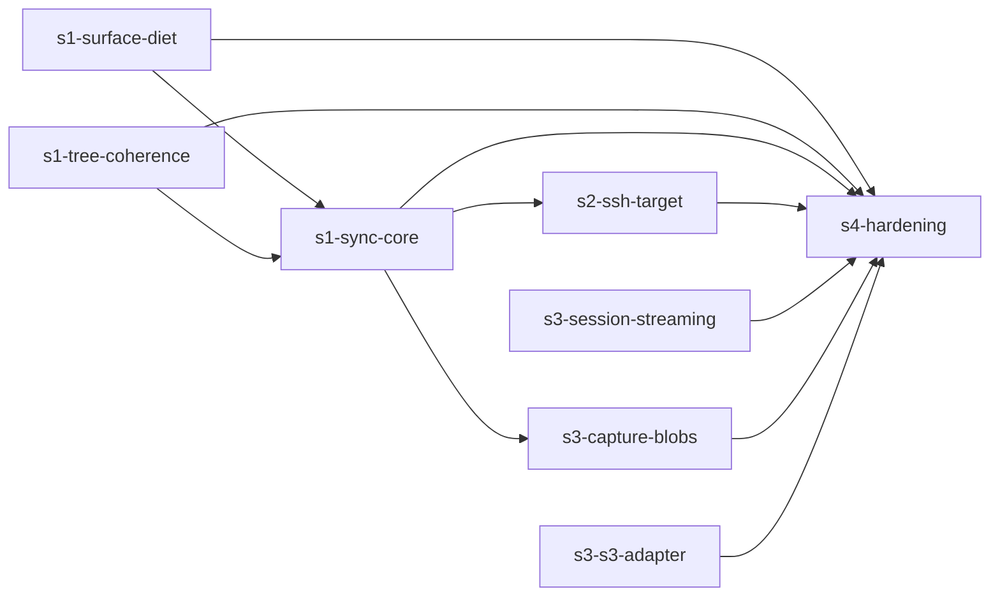

# tuddofs task board

Execution briefs for the remaining roadmap. The normative source for every algorithm, invariant, and table is `../architecture.md` — briefs carry scope, sequencing, and acceptance only, and deliberately do NOT restate spec content. If a brief and the spec disagree, the spec wins; fix the brief.

Shipped work (kernel, session, grants, merge/staged/approver, restore, tags, pin, virtual mounts, GC, verify, direct adapter) is done with test evidence and has no task file.

## How to work a task

1. Read the task file and every spec section it names, fully, before writing code.
2. Update the `Status` line in the task file as you go: `open` → `in-progress` → `done` (with a one-line evidence pointer). Commit the status change with the work.
3. Test loop (from the repo README): `npm test` for hermetic units; disposable Postgres + `TUDDOFS_DATABASE_URL=… npm run test:integration` for integration. Never point at a shared database.
4. Methodology is binding: `architecture.md` §13 (golden tests append-only, no xfail/skip, README updated in the same PR as any surface change, errors typed per §9).
5. Stuck or the spec is ambiguous → stop and ask; do not invent semantics.

## Dependency graph

`s1-surface-diet` + `s1-tree-coherence` are independent of each other and ship together as ONE breaking release before any sync-engine code lands. `s3-session-streaming` and `s3-s3-adapter` are parallel-safe at any time.

## Board

| Task | Stage | Status | Depends on |
|---|---|---|---|
| [s1-surface-diet](s1-surface-diet.md) | S1 pre-work | open | — |
| [s1-tree-coherence](s1-tree-coherence.md) | S1 pre-work | open | — |
| [s1-sync-core](s1-sync-core.md) | S1 | open | s1-surface-diet, s1-tree-coherence |
| [s2-ssh-target](s2-ssh-target.md) | S2 | open | s1-sync-core |
| [s3-session-streaming](s3-session-streaming.md) | S3 | open | — |
| [s3-capture-blobs](s3-capture-blobs.md) | S3 | open | s1-sync-core |
| [s3-s3-adapter](s3-s3-adapter.md) | S3 | open | — |
| [s4-hardening](s4-hardening.md) | S4 | open | everything above |
